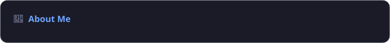
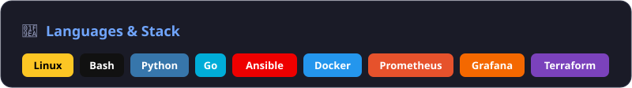
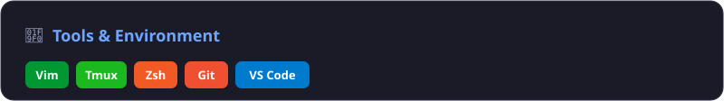
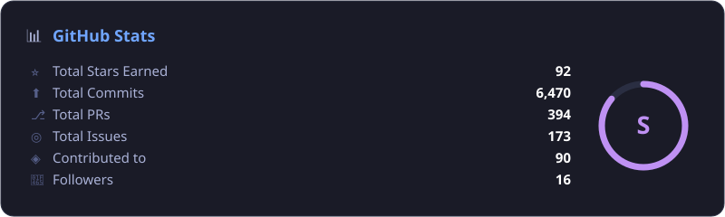
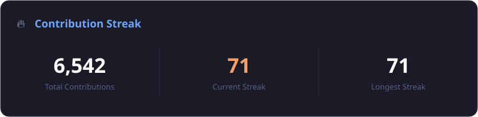
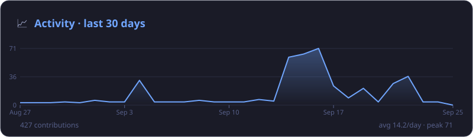
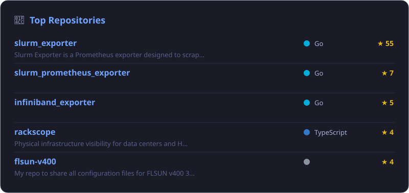
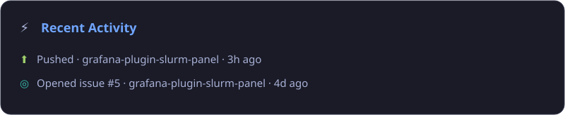
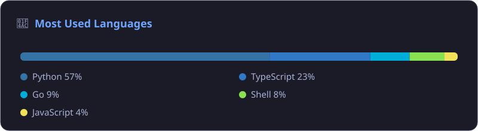
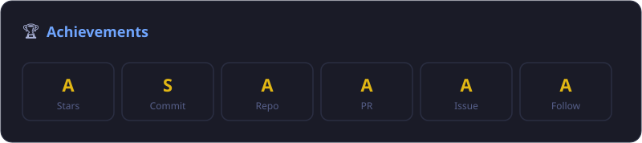

  

  <h1>Hi, I'm <code>Tom</code> 👋</h1>
  <h3><code>SckyzO</code> • <code>Thomas Bourcey</code></h3>

  

    
  

  

    
  

  <a href="https://sckyzo.github.io/SckyzO/cards/">🖥️ View the interactive dashboard →</a>

---

 

 

 

 

 

 

 

 

 

 

---

  

